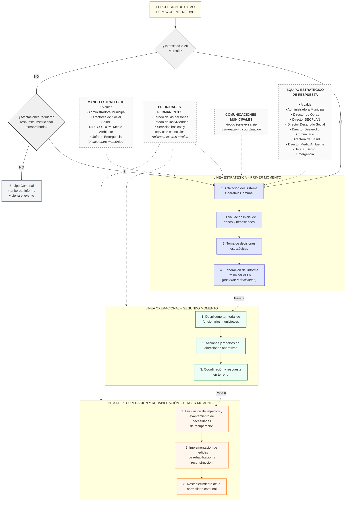

# SISMO - Sistema de Respuesta a Emergencias por Sismo

## Descripción
Sistema operativo comunal para la respuesta integral ante eventos sísmicos de alto impacto. Estructura tres líneas de acción coordinadas: estratégica, operacional y de recuperación.

## Diagrama del Sistema

## Estructura del Sistema

### Criterios de Activación
- **Intensidad ≥ VII en Escala Mercalli**, O
- **Afectaciones que requieren respuesta institucional extraordinaria**

### Tres Líneas de Acción

#### 1️⃣ Línea Estratégica (Primer Momento)
- Activación del Sistema Operativo Comunal
- Evaluación inicial de daños y necesidades
- Toma de decisiones estratégicas
- Elaboración del Informe Preliminar ALFA

#### 2️⃣ Línea Operacional (Segundo Momento)
- Despliegue territorial de funcionarios municipales
- Acciones y reportes de direcciones operativas
- Coordinación y respuesta en terreno

#### 3️⃣ Línea de Recuperación (Tercer Momento)
- Evaluación de impactos y levantamiento de necesidades
- Implementación de medidas de rehabilitación y reconstrucción
- Restablecimiento de la normalidad comunal

### Prioridades Permanentes
1. **Estado de las personas**
2. **Estado de las viviendas**
3. **Servicios básicos y servicios esenciales**

*Aplican a los tres niveles del sistema*

### Mando y Coordinación
- **Mando Estratégico**: Alcalde, Administradora Municipal, Directores
- **Enlace entre Momentos**: Jefa de Emergencia
- **Apoyo Transversal**: Comunicaciones Municipales

